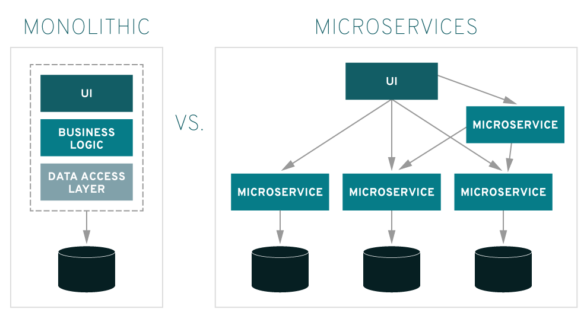

### What is Docker?
- open source software for containerisation - developing, shipping and running applications

- What is the difference between VM and Docker containerisation
- VM emulate a OS and therefore are resource intensive while containerisation shares the machines resources making it super light weight.

### What are the benefits of Docker?
- Consist delivery of your application
- light weight
- open-source
- Can be scaled up significantly using Kubernetes


### Docker client - localhost
- Host machine --> API calls --> Docker Daemon --> Docker Hub

                  Docker pull

                  Docker Build

                  Docker run


Docker looks for containers on the local host first and if they are not available makes an API call that connects with the Docker Daemon. If the image does not exist within the docker daemon it goes to the docker hub and returns the image to the local host

### Microservices excercise

#### 1. create a docker-compose file (.yaml/yml)

- Docker compose is a tool for defining and running multi-container docker applications. With compose, you use a yaml file to configure your application's services.  


```
version: '3'

services:
  db:
    image: mongo
    restart: always
    ports: [27017:27017]
#    volumes:
#      - 'db:/data/db'

  web:
    build: ./app
    restart: always
    ports: [3000:3000]
    environment:
      - DB_HOST=mongodb://db:27017/posts
    depends_on:
      - db
 #   volumes:
#      - '.:/app'
#volumes:
 # db: {}
```

#### 2. Running the docker compose file
```
docker-compose Build
```

```
docker-compose up -d
```

```
docker exec 291d63f4c29f sh
```


### What is Microservices?

- Microservices – Also known as the microservice architecture is an architecture style that structures an application as a collection of services that are: Highly maintainable and testable

- loosely coupled
- Independently deployable
- Organized around business capability’s
- Owned by a small team

### Advantages of Microservices

- **Scalability**: Since the services are seperate, we can easily scale the most needed services when necessary as opposed to scaling the whole application, thus improving cost savings

- **Faster Deplyoments**: Smaller codebases allows for quicker deployments and thus improving the efficiency of the CI/CD pipeline. Leading to greater customer satisfaction

- **More technological flexibility**: Smaller services means that you can try out new tools on an individual service without it affecting the rest of the application, this means organisations can experiment between more efficient tools


### Disadvantages of Microservices

- **May not be benefifial for small businesses**: Microservices can be difficult to implement for smaller business who don't want to be bogged down in complex orchestration between all the services


### What is Monolithic Architecture?

- Monolithic Architecture is a architecture, which contains all the services and components of an application as single package.
- We can simplify this as "Way of maintaining all the services that are offered by an application in a single resource or as a single package".


