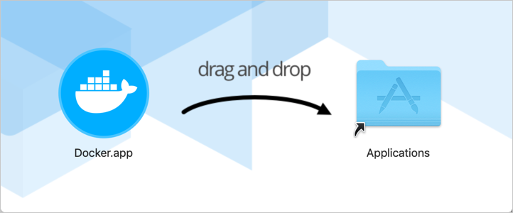

### Installing Docker on Mac OS

[Download docker for mac OS](https://hub.docker.com/editions/community/docker-ce-desktop-mac/)

### 1. Install and run Docker Desktop on Mac

- double-click ``Docker.dmg`` to open the installer, then drag the docker icon to the application folder.

### 2. Click on the Docker in in launch pad

